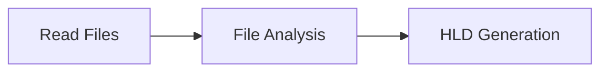

# Power Apps Code Analyzer

A Python-based tool that automatically analyzes Microsoft Power Apps code files and generates comprehensive High-Level Design (HLD) documentation using Large Language Models and LangGraph workflow orchestration.

## 🚀 Features

- **Automated Code Analysis**: Scans Power Apps source files (`.fx.yaml` and `.json` formats)
- **Intelligent File Processing**: Handles both modern Power Apps (`.fx.yaml`) and legacy formats (`.json`)
- **LLM-Powered Summaries**: Generates detailed summaries for each code file
- **High-Level Design Generation**: Synthesizes individual file summaries into comprehensive HLD documentation
- **Workflow Orchestration**: Uses LangGraph for robust, visual workflow management
- **Error Handling**: Graceful handling of file encoding issues and processing errors

## 📋 Prerequisites

- Python 3.8+
- Local LM Studio instance running on `http://192.168.0.110:1234/v1`
- Power Apps source code in a `src/` directory

## 🛠️ Installation

1. Clone this repository:
   ```bash
   git clone <repository-url>
   cd powerapp-analyzer
   ```

2. Install required dependencies:
   ```bash
   pip install langgraph langchain openai ipython
   ```

3. Ensure your LM Studio is running with the Qwen 3-4B model at the specified endpoint.

## 📁 Project Structure

```
project-root/
├── src/                    # Power Apps source files
│   ├── *.fx.yaml          # Modern Power Apps files (preferred)
│   └── controls/          # Legacy JSON files location
│       └── *.json
├── analyzer.py            # Main analysis script
└── README.md
```

## 🔧 Configuration

### LLM Configuration
The tool is configured to use a local LM Studio instance. Update the following parameters in the code if needed:

```python
llm = ChatOpenAI(
    openai_api_base="http://192.168.0.110:1234/v1",  # Your LM Studio URL
    openai_api_key="lmstudio",                       # API key (if required)
    model="qwen/qwen3-4b",                          # Model name
    temperature=0.1                                  # Temperature setting
)
```

### File Processing Priority
1. **Primary**: `.fx.yaml` files (modern Power Apps format)
2. **Fallback**: `.json` files in `controls/` folder (legacy format)

## 🚀 Usage

1. Place your Power Apps source files in the `src/` directory
2. Run the analyzer:
   ```bash
   python analyzer.py
   ```

3. The tool will:
   - Scan and read all relevant files
   - Generate individual file summaries
   - Create a comprehensive HLD document
   - Display the workflow graph
   - Print the final HLD document

## 📊 Workflow Overview

The analysis follows a three-stage LangGraph workflow:



### Stage 1: File Reading (`read_files`)
- Scans the `src/` directory for Power Apps files
- Prioritizes `.fx.yaml` files over `.json` files
- Handles encoding issues gracefully
- Collects file metadata and content

### Stage 2: File Analysis (`node_1`)
- Analyzes each file individually using LLM
- Extracts key information:
  - Screens, components, and entities
  - Data sources and variables
  - Navigation logic and user interactions
  - Business rules and special processing

### Stage 3: HLD Generation (`node_2`)
- Synthesizes individual file summaries
- Generates comprehensive documentation including:
  - Executive Summary
  - Application Architecture Overview
  - Data Model
  - Navigation and User Flow
  - Custom Logic and Key Interactions
  - Integration Points
  - Special Features and Business Rules

## 📄 Output Format

The tool generates a detailed High-Level Design document containing:

- **Executive Summary**: Business context and purpose
- **Architecture Overview**: Key modules and their relationships
- **Data Model**: Entities, data sources, and relationships
- **Navigation Flow**: User journeys and screen transitions
- **Custom Logic**: Important formulas and business rules
- **Integration Points**: External service connections
- **Component Summary**: Screen and component responsibilities

## 🔧 Customization

### Modifying Analysis Prompts
Edit the `node1_prompt` and `system_prompt_hld` variables to customize the analysis focus or output format.

### Adding New File Types
Extend the `read_files` function to support additional file formats:

```python
if file.endswith('.your_extension'):
    # Add processing logic
```

### Changing Output Format
Modify the `node_2` function to save output in different formats (PDF, HTML, etc.).

## 🐛 Troubleshooting

### Common Issues

1. **LM Studio Connection Failed**
   - Ensure LM Studio is running on the specified URL
   - Check firewall settings
   - Verify the model is loaded

2. **No Files Found**
   - Verify Power Apps files are in the `src/` directory
   - Check file extensions (`.fx.yaml` or `.json`)
   - Ensure proper directory structure

3. **Encoding Errors**
   - The tool handles common encoding issues automatically
   - Check file integrity if problems persist

4. **Memory Issues**
   - Large applications may require more memory
   - Consider processing files in smaller batches

## 📈 Performance Tips

- **File Organization**: Keep related files in logical subdirectories
- **Model Selection**: Use appropriate model size for your hardware
- **Batch Processing**: For large applications, consider processing subsets of files

## 🤝 Contributing

1. Fork the repository
2. Create a feature branch
3. Make your changes
4. Add tests if applicable
5. Submit a pull request

## 📝 License

This project is licensed under the MIT License - see the LICENSE file for details.

## 🙏 Acknowledgments

- Built with [LangGraph](https://github.com/langchain-ai/langgraph) for workflow orchestration
- Uses [LangChain](https://github.com/langchain-ai/langchain) for LLM integration
- Powered by [LM Studio](https://lmstudio.ai/) for local LLM execution

## 📞 Support

For issues, questions, or contributions, please open an issue in the repository or contact the maintainers.

---

**Note**: This tool is designed for analyzing Power Apps code structure and generating documentation. It does not execute or modify your Power Apps applications.
